# Ripple

A full-stack social media application — posts, likes, comments, follows, profiles, and image uploads. Web and mobile share one typed API client; mobile ships JS/asset updates over the air via EAS Update, gated by server-evaluated feature flags.

## Screenshots

### Feed & explore

| Web | Mobile |
| --- | --- |
| 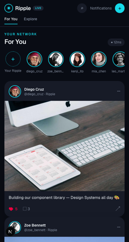 | 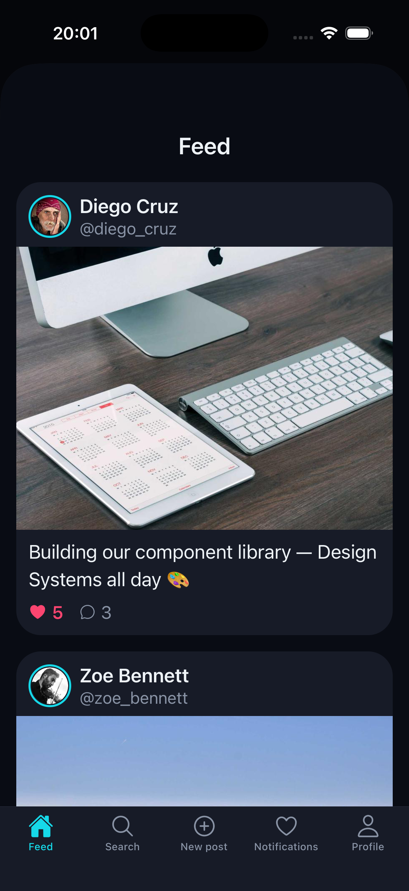 |
| 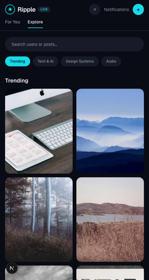 | 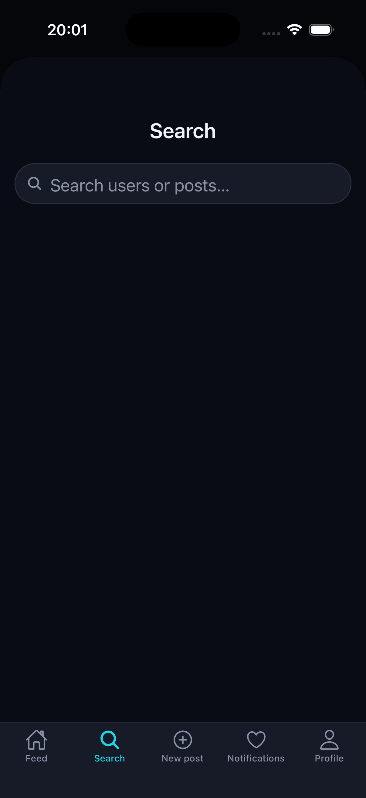 |

### Posts, likes & comments

| Web | Mobile |
| --- | --- |
| 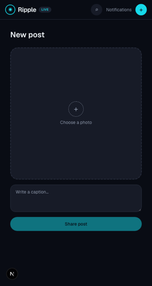 | 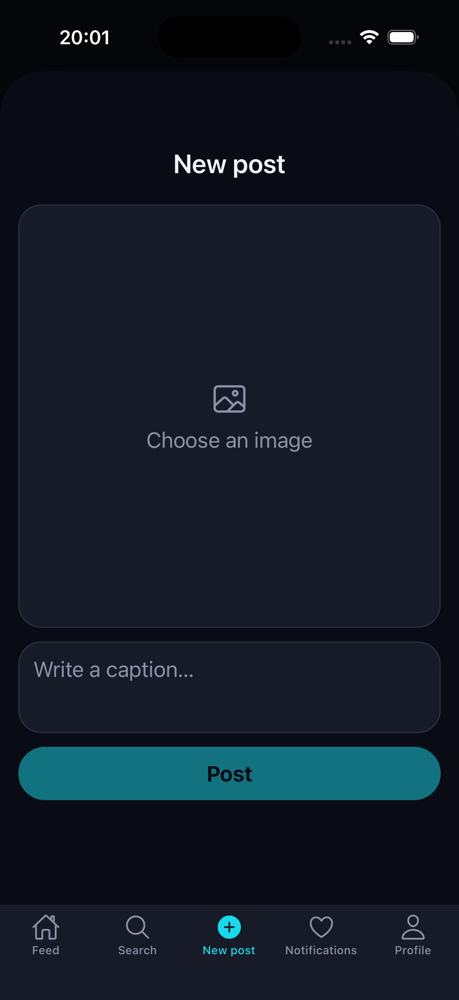 |
| 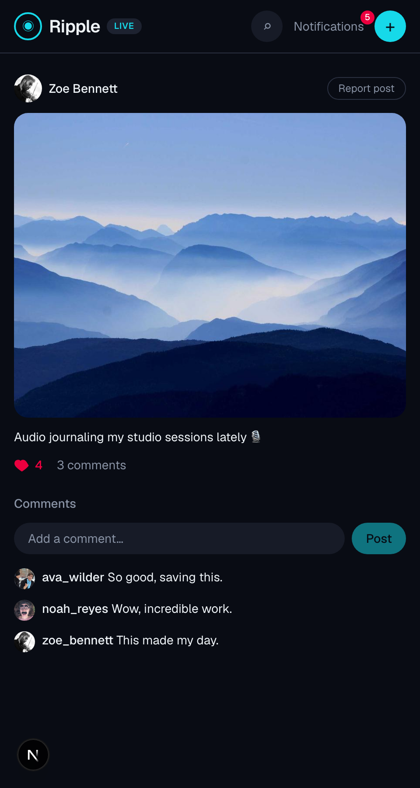 | 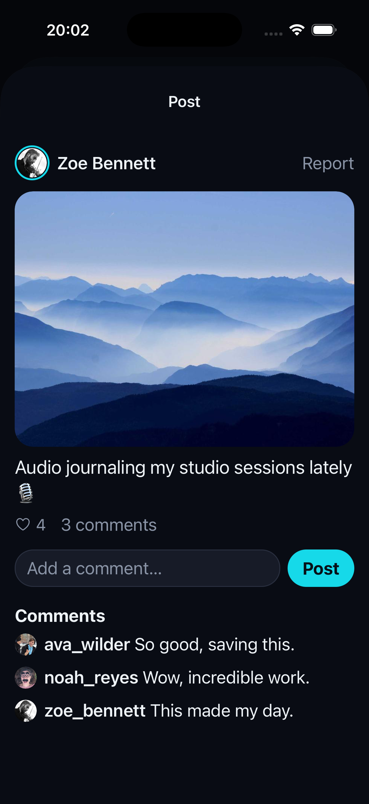 |

### Profiles & follows

| Web | Mobile |
| --- | --- |
| 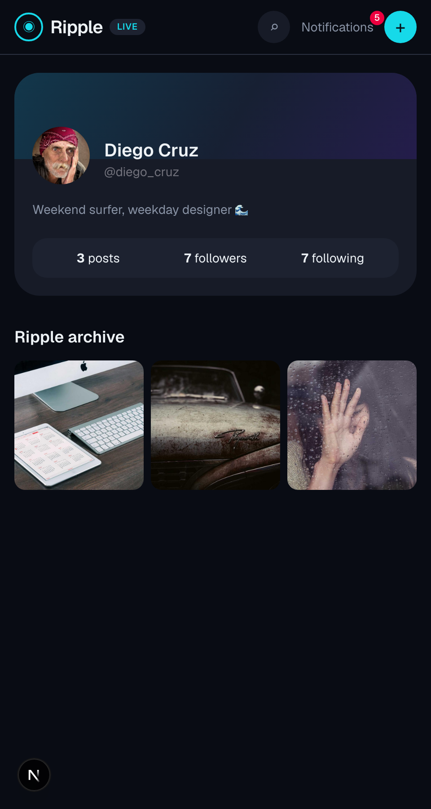 | 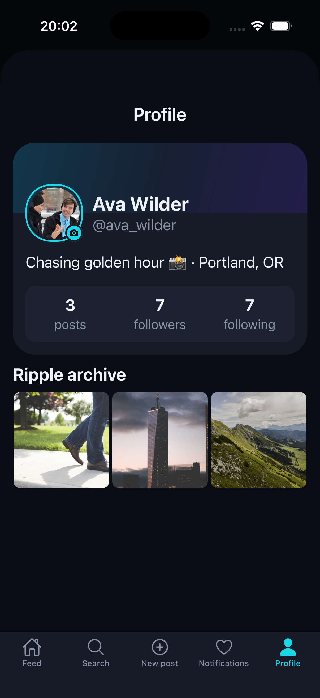 |
| 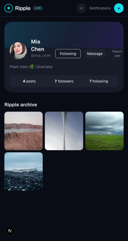 | 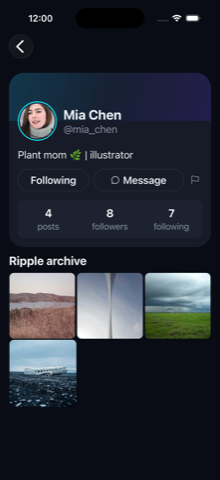 |
| 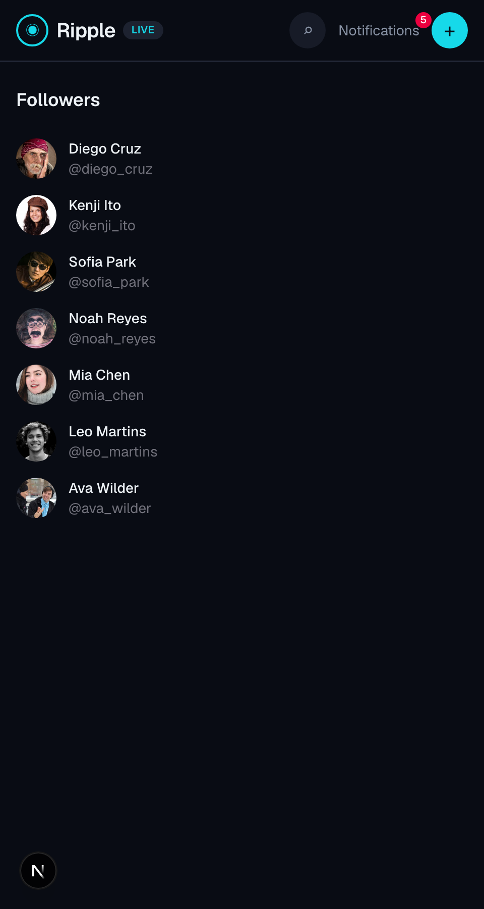 | 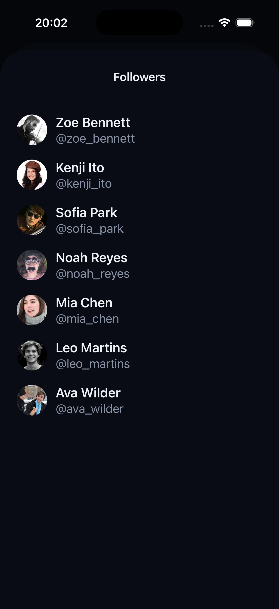 |
|  | 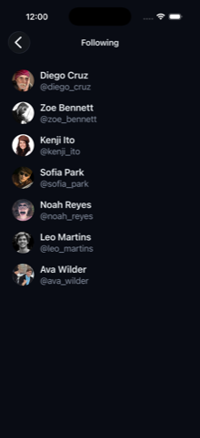 |

### Notifications & chat

| Web | Mobile |
| --- | --- |
| 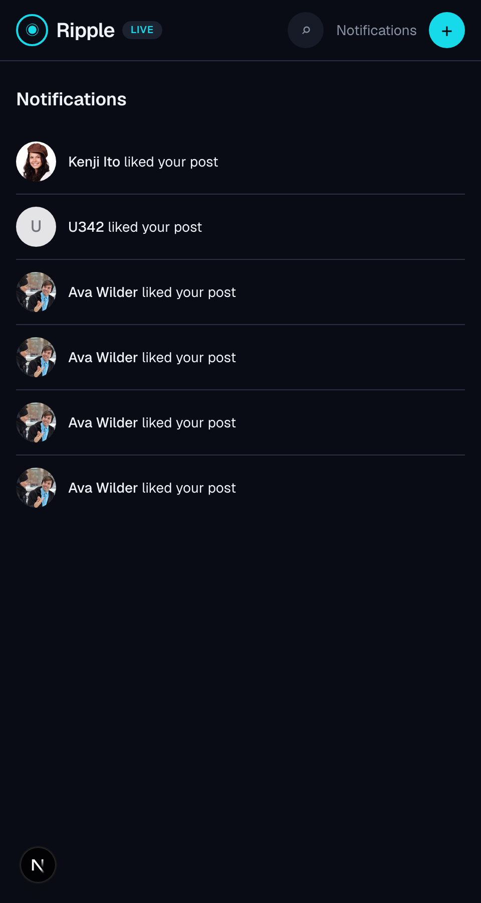 | 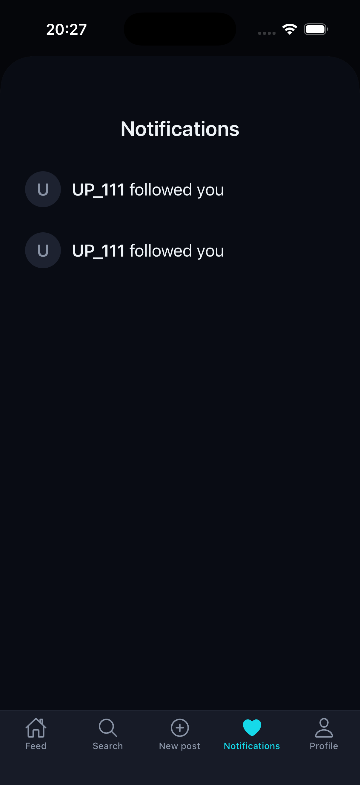 |
| 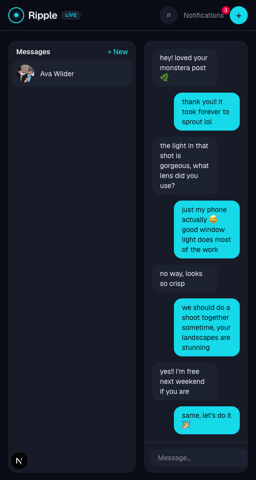 | 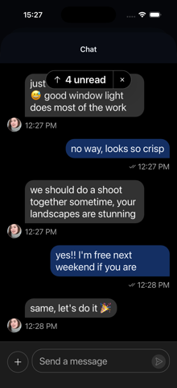 |

### Reporting & admin

Reporting a user, on web (the popover next to Follow/Message) — on mobile the same flow is a native action sheet, not pictured. The admin dashboard for reviewing reports and banning users is web-only.

| Report popover (web) | Admin dashboard (web) |
| --- | --- |
| 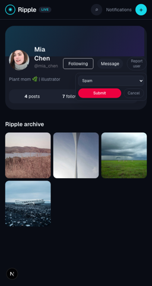 | 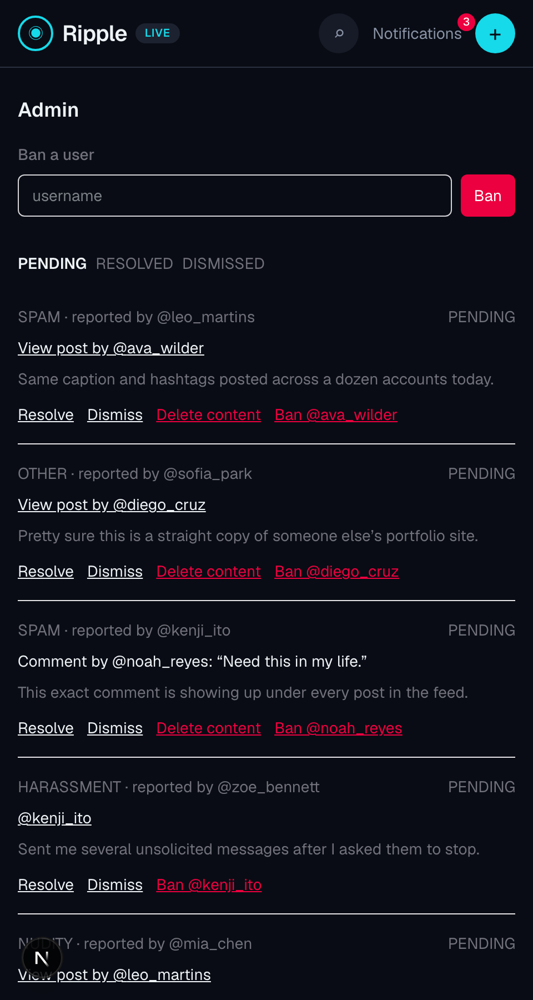 |

### Auth

| Web | Mobile |
| --- | --- |
| 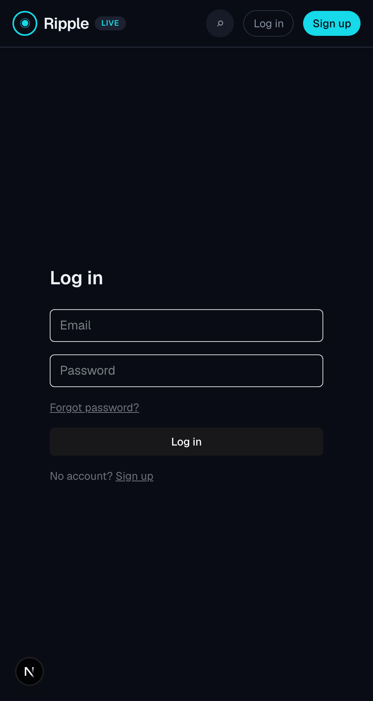 | 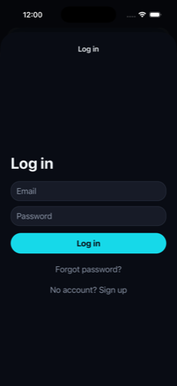 |
|  | 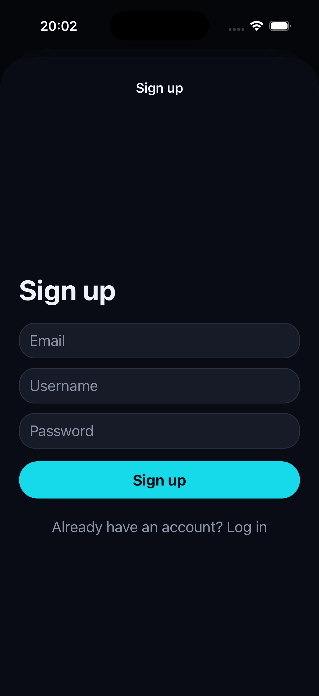 |
| 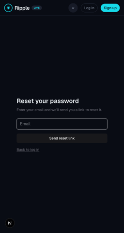 | 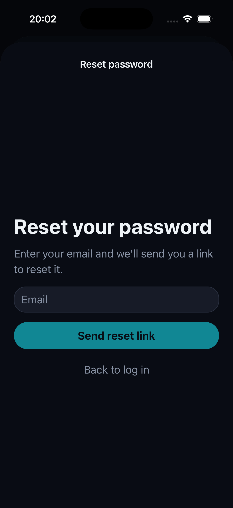 |

## Structure

```
ripple/
├── backend/            NestJS + Fastify API (PostgreSQL, Prisma, JWT auth)
├── web/                Next.js web client
├── mobile/             Expo (React Native) client, with OTA updates
└── packages/
    └── api-client/     Typed API client shared by web and mobile
```

npm workspaces link `@ripple/api-client` into both apps — install once from the repo root.

## Stack

- **API**: NestJS on Fastify, PostgreSQL via Prisma, JWT access/refresh auth, Cloudinary for image storage
- **Web**: Next.js, TypeScript, Tailwind CSS
- **Mobile**: Expo, React Native, EAS Update for OTA delivery
- **Shared**: `@ripple/api-client` — one typed client, request/response types, and refresh-token handling for both platforms

## Getting started

```bash
npm install   # installs and links all workspaces
```

### API

```bash
cd backend
cp .env.example .env   # fill in DATABASE_URL, JWT secrets, Cloudinary keys
npx prisma migrate dev
npm run db:seed        # seeds the `chat` feature flag
npm run start:dev
```

The API runs on `http://localhost:3001/api`.

### Web

```bash
cd web
npm run dev
```

The web app runs on `http://localhost:3000`.

### Mobile

```bash
cd mobile
npx expo start
```

Feed, search, post creation, profiles and auth are all built as native screens (`expo-router`). See `mobile/README.md` for structure and OTA update setup with EAS.

## Features

- Email/password authentication with rotating refresh tokens
- User profiles with avatar upload
- Post creation with image upload, captions, and a paginated feed
- Likes and comments
- Follow / unfollow with follower and following lists
- User and post search
- Server-evaluated feature flags with deterministic rollout percentages, so a feature can ship in an OTA update but stay dark until enabled gradually
- In-app notifications for likes, comments and follows, with an unread badge on web and mobile
- Reporting for posts, comments and users, with an admin dashboard (web) to review reports, ban users, and remove content
- Real-time 1:1 chat (web and mobile) via Stream Chat, gated behind the `chat` feature flag — see `backend/src/chat`
- Password reset via email (console-logged in dev, SMTP in production — see `backend/src/mail`)
